# Airbnb Toronto Capstone Project

## Introduction

Airbnb is an American company that operates an online community marketplace for people to list, discover, and book accommodations worldwide. Home-owners (also known as 'hosts') are allowed to rent their properties (also known as 'listings') ranging from entire homes, apartments, single or shared bedrooms to individuals or businesses for a charge. 

## Business Problem

**" How much money is your place worth as a short-term rental on Airbnb? "**

Although Airbnb provides the host with a general tip regarding the default nightly price of their property upon listing, the final decision regarding the property price ultimately rests with the host. Paid third party pricing softwares are available, however the hosts are required to first determine the average price by themselves. The algorithm will then vary the daily price around the base price each day depending on several factors such as seasonality, day of the week, etc. In today's dynamic market, it is extremely important for the Airbnb owners to get the pricing right, particularly in big cities like Toronto, where there is stiff competition and a very thin line between success and failure.

## Our Goal

The average nightly price of Airbnbs in a city like Toronto can be influenced by multiple factors such as the type of property, number of people it accommodates, the amenties included, the neighbourhood where it is located, etc. This project aims to help the Airbnb hosts decide the average nightly price for their properties and maximize their earnings by using machine learning regression techniques that can accurately predict the base prices.

## Data Overview

The datasets used for this project are sourced from [Inside Airbnb](http://insideairbnb.com/). This site is not associated with or endorsed by Airbnb or any of its competitors. The data utilizes public information compiled from the Airbnb website. No "private" information has been used. The datasets used for this project are recent and was scraped on June 05,2022 and contains all the information on Toronto Airbnb listings that were active as on that date.

We have used the following datasets from the Inside Airbnb website :

- listings.csv.gz
- calendar.csv.gz
- neighbourhoods.geojson

Additionally, we have scraped data from [Wikipedia](https://en.wikipedia.org/wiki/List_of_postal_codes_of_Canada:_M) to extract the Toronto Borough names for the purpose of our analysis.

## Tools Used

For this project we have used the following tools and technologies:

Analysis:
- Python (Pandas, Numpy, Matplotlib, Seaborn)

Database:
- PostgreSQL and Amazon Web Services [Images Here](https://github.com/Sukanya807/Capstone_Project_Group_01/tree/main/Resources/images/database)

Visualization:
- Python
- Tableau [Dashboard Link Here](https://public.tableau.com/app/profile/yesha4974/viz/FinalDashboard2_16597388198810/Story42)

Machine Learning:
- XGBoost Regression Model (Scikit-learn) 
- GridSearch CV hyper-parameter tuning

Notebook:
- Jupyter Notebook
- Google Colab
- [Data Cleaning Notebook](https://github.com/Sukanya807/Capstone_Project_Group_01/blob/main/ETL/airbnb_ETL.ipynb)
- [Exploratory Data Analysis Notebook](https://github.com/Sukanya807/Capstone_Project_Group_01/blob/main/ETL/airbnb_ETL.ipynb)
- [Machine Learning Notebook](https://github.com/Sukanya807/Capstone_Project_Group_01/blob/main/ML/Machine_Learning.ipynb)

## Entity Relationship Diagram (ERD)

- id - Airbnb's unique identifier for the listing

- host_since - the date host/user was created

- host_response_time - time taken for host to respond

- host_response_rate - the rate at which a host accepts booking requests

- host_is_superhost - whether a host is superhost or not

- host_listings_count - the number of listings the host has

- host_identity_verified - whether the host is verfied or not

- neighbourhood_cleansed - the neighbourhood as geocoded using the latitude and longitude against neighbourhoods as defined by open or digital public shapefiles

- latitude - uses the World Geodetic System (WGS84) projection for latitude and longitude.

- longitude - uses the World Geodetic System (WGS84) projection for latitude and longitude.

- property_type - self selected property type. Hotels and Bed and Breakfasts are described as such by their hosts in this field

- room_type - entire place, private room, shared room

- accommodates - the maximum capacity of the listing

- bathrooms - the number of bathrooms in the listing

- bedrooms - the number of bedrooms

- beds - the number of bed(s)

- amenities - amenties included with the property

- price - daily price in local currency

- minimum_nights - minimum number of night stay for the listing (calendar rules may be different)

- maximum_nights - maximum number of night stay for the listing (calendar rules may be different)

- availability_90 - the availability of the listing x days in the future as determined by the calendar. Note a listing may not be available because it has been booked by a guest or blocked by the host.

- number_of_reviews - the number of reviews the listing has

- number_of_reviews_ltm - the number of reviews the listing has (in the last 12 months)

- first_review - the date of the first/oldest review

- last_review - the date of the last/newest review

- review_scores_rating - rating score

- review_scores_accuracy - accuracy score

- review_scores_cleanliness -cleanliness score

- review_scores_checkin - checkin score

- review_scores_communication - communication score

- review_scores_location - location score

- review_scores_value - value score

- instant_bookable - whether the guest can automatically book the listing without the host requiring to accept the booking decision

## Data Analysis

### Airbnb Listings Distribution in Toronto

There are approximately 15,000 Airbnb listings in Toronto as of June,2022.

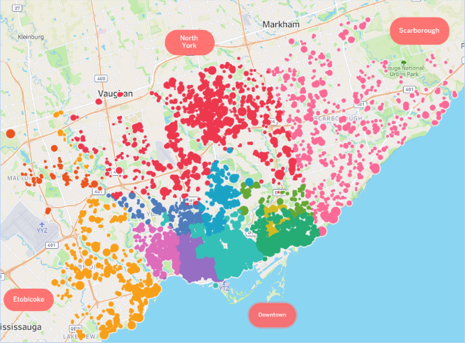

### Number of hosts joining Airbnb each month

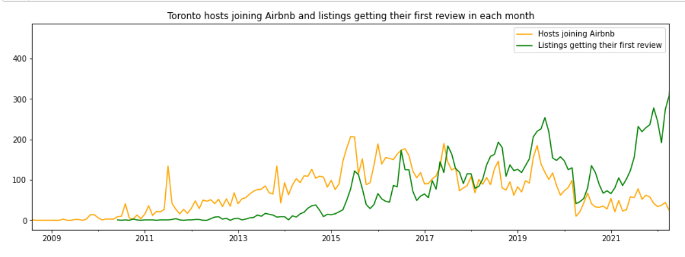

### Number of First Reviews

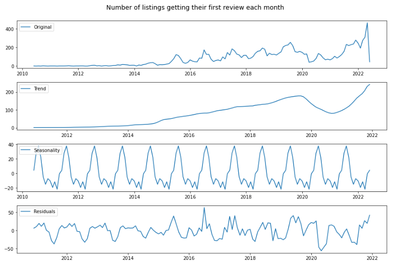

#### Observations

- From the graph, we can see that the number of hosts who joined Airbnb in Toronto was the highest in 2015 and had been more or less steady till 2019. The number has dropped since 2020 onwards. This drop could be an effect of COVID-19 or change in Government laws regarding short-term rentals in Toronto.
- The seasonality graphs for the number of reviews indicate more reviews during the middle of the year, particularly the summer months when tourism increases. That explains majority of hosts joining Airbnb at the same time of the year.

This fact gets further corroborated by the analysis done on the calendar.csv.gz file. According to the calendar file analysis, we can conclude that:

- Average nightly prices are the highest in August. This could be due to summer weather in Toronto accompanied by summer holidays in schools.
- In terms of weekdays, Saturdays command the highest average nightly prices.

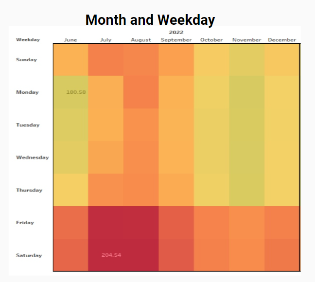

### Average Number of Listings Per Host

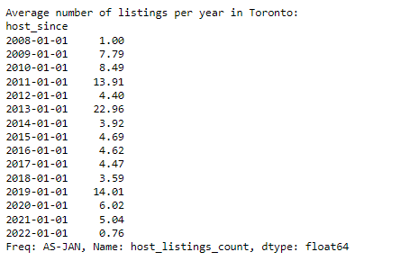

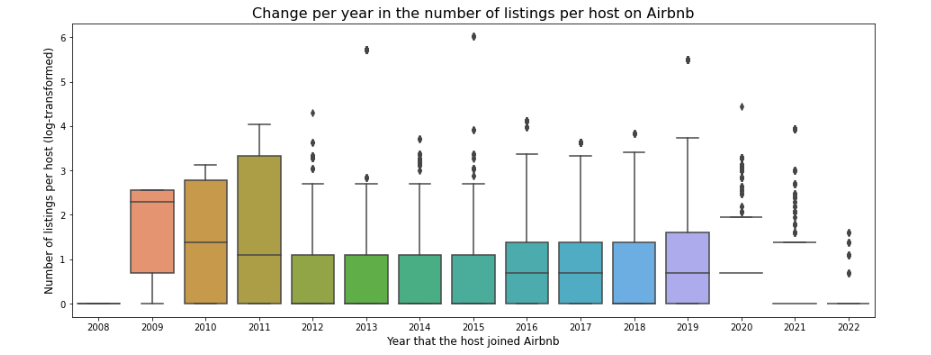

#### Observations

- The average number of listings per year per host was highest around 2013 when Airbnb started gaining popularity in Canada. After 2013, 2019 was a good year for Airbnb, but the number of listings has again started going down since 2020 which could be attributed to the aftermath of COVID-19.
- Also, from the host_listings_count, it is clear that like other countries, there are professional Airbnb management companies in Toronto that host a large number of listings under a single host profile.

### Airbnb Yearly Average Price Change

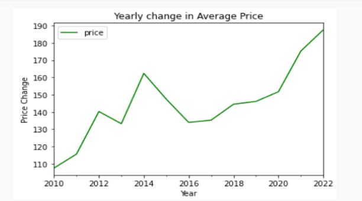

#### Observations

- The average price of renting Airbnb has increased steadily since 2010. Particularly, prices have gone up since 2021.
- Average prices have gone up by 75% in 2022 compared to 2010.

### Average Price by location for different property types

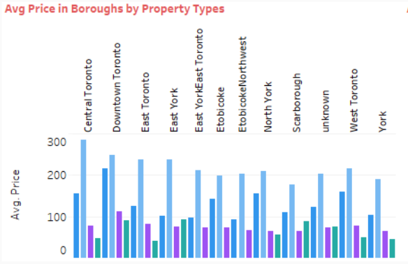

#### Observations

- Renting an entire home is the most expensive in all boroughs followed by renting an entire apartment.
- Except Downtown Toronto, one rooms and shared rooms can be rented at less than $100 CAD.

### Location of Majority of Airbnb Hosts and Number of Reviews

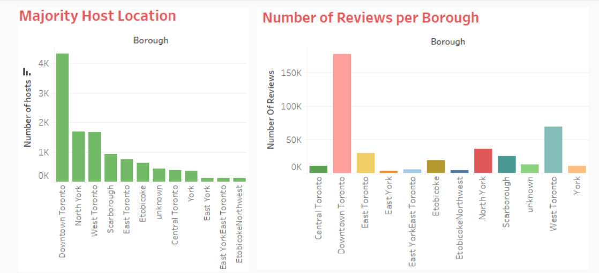

#### Observations

- Majority of the hosts are located in Downtown Toronto.The average number of reviews by guests are also the highest in Downtown Toronto. It indicates that Downtown Toronto is the most popular region among hosts and guests. 

### Majority of the Property Types in Toronto

#### Observations

- Most of the property types in Downtown Toronto region are apartments.
- West Toronto has the highest number of individual home type properties.
- One room options are mostly available in Downtown Toronto and North York

### Average Price by Room Type

#### Observations

- The average price for renting an entire home/ apartment is approximately $180 CAD.
- The average price for renting a hotel room is approximately $60 CAD.
- The average price for renting a private room is approximately $80 CAD.
- The average price for renting a shared room is approximately $70 CAD.

### Average Price by the number of people the property accommodates

#### Observations

- properties that can accommodate 14 guests are the costliest.
- cheap options are available for single person at less than $100 per night.
- average rental prices are above $200 for number of guests exceeding 4

### 5 Most and Least Expensive Neighbourhoods

### Observations

The five most expensive neighbourhoods in Toronto are

- Bridle Path-Sunnybrook-York Mills with an average price of $281.
- Waterfront Communities-The Island with an average price of $ 242.
- Rustic with an average price of $198.
- Bay Street Corridor with an average price of $ 197.
- Niagara with an average price of $196.

The five least expensive neighbourhoods in Toronto are

- Black Creek with an average price of $45.
- Eglinton East with an average price of $60.
- West Hill with an average price of $64.
- Glenfield-Jane Heights with an average price of $65.
- Pleasant View with an average price of $69.

### Maximum and Minimum Price by Borough

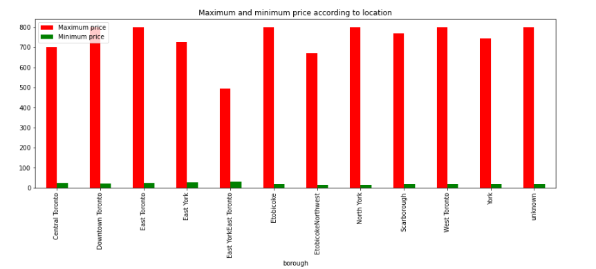

### Observations

- East YorkEast Toronto region seems to be the cheapest of all boroughs with a maximum price of approximately $500.
- There is a huge difference between the minimum and maximum prices in all boroughs.
- Minimum prices can be less than $50 while maximum prices can go beyond $800.

### How much difference does the ratings make in terms of price?

### Observations

- Properties with Excellent Ratings can charge 8.4% higher prices than properties with Average Ratings.
- Properties with Excellent Ratings can charge 13% higher prices on an average compared to properties with Poor Ratings.

### Superhost, Verified Identity, Instant Bookable vs. price

### Observations

- Around 25% of the Airbnb hosts are superhosts. However, being a superhost does not seem to have a significant impact on average price charged per night.
- Around 90% of the Airbnb hosts in Toronto are verified. Hosts with verified identity charge approximately 25% higher prices compared to hosts whose identities are not verified.
- Around 29% of the Airbnbs in Toronto are instantly bookable. It does not provide any benefits in terms of average nighly prices charged.

### Popular Amenities and their impact on Average Price

1
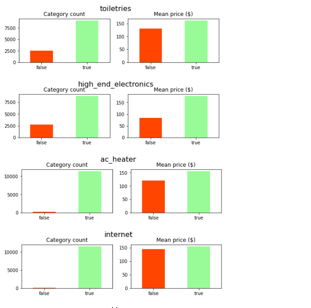    
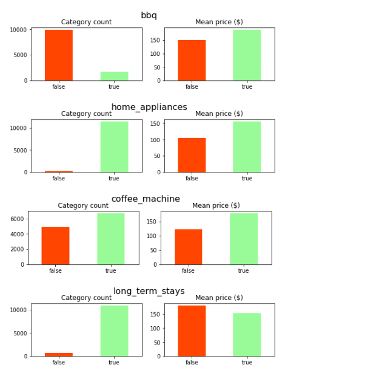
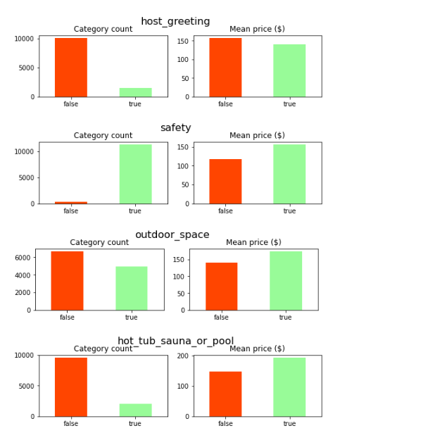
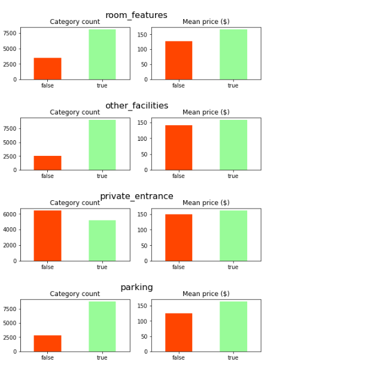
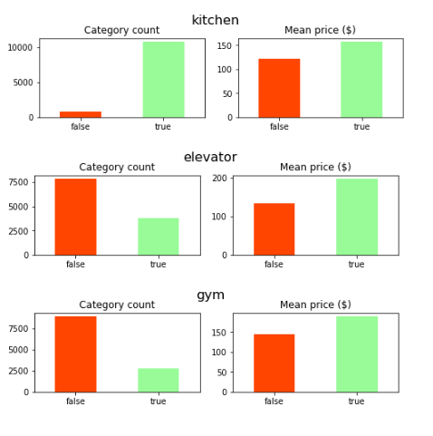

### Observations

Most Airbnbs provide amenties like:

- Toiletries - like soap and shampoo
- high-end electronics - like TV and music systems
- Air Conditioners and heaters
- Internet
- Home Appliances like microwaves, refrigerator,etc
- Coffee Machines
- Long term stays
- Safety equipments like fire alarms
- Bed linens, pillows and closets
- Parking Facilities
- Kitchen

Most Airbnbs charge higher average prices for amenities like:

- Toiletries
- High-end electronics
- Air conditioning and heating
- BBQ facilities
- Home Appliances and coffee machines with kitchen
- Safety features
- Outdoor Space and hot-tubs or pools
- Parking, elevators and gyms

### Additional Observations

- There is not much difference in price for providing Internet.
- Places allowing long term stays and host greetings have lower rent prices per night.

## Machine Learning for Price Predictions

We have tried different machine learning regression models on the clean data to predict prices as accurately as possible. Columns with high correlations have been removed or transformed and data has been scaled using 'yeo-johnson' Power Transformer to achieve normal distribution as much as possible.

### Different Models Tried:

- Linear Regression Model - RMSE test: 79.39 , R^2 test: 0.550
- Support Vector Regression Model - RMSE test: 100.08, R^2 test: 0.284
- GradientBoostingRegressor Model - RMSE test: 69.52, R^2 test: 0.655
- RandomForestRegressor Model - RMSE test: 69.17, R^2 test: 0.658
- ExtraTreesRegressor Model - RMSE test: 68.75, R^2 test: 0.662
- XGBoostRegressor Model - RMSE test: 68.26, R^2 test: 0.667

The XGBoost method performed the best out of all models.

### Hyper-Parameter Tuning Using GridSearchCV 

We have further tried to improve our model through hyper-parameter tuning using GridSearchCV method. Deep Learning methods were not tested on this data since we felt that the volume of data available does not justify using neural networks. 

##### GridSearchCV Results

1

After hyper-parameter tuning using the GridSearchCV method, we achieved an RMSE testing score of 67.4 with a R² score of 0.676.

#####  Top 10 Feature Importance using XGBoost Regressor Model

As per the XGBoost model, the most important features for Airbnb price prediction are:

- neighbourhoods
- property type
- accommodates
- bathroom
- host response rate

## Conclusion

Our best performing machine learning model was only able to explain 68% of the variation in price. The remaining 32% could be made of other features that were not present in our data like points of interests near the property, the property's proximity to restaurants, cafes,etc. We have not performed Natural Language Processing or Sentiment Analysis on this dataset. Perhaps a more detailed analysis of the reviews column could also improve the predictions. Finally, we believe that incorporating image quality into the machine learning model can also be helpful since photos of the properties on Airbnb websites can have a major impact on guests and can command higher prices as well.

Contributors :

- Caroline Semerano
- Sukanya Ghosh
- Yesha Tharwala

