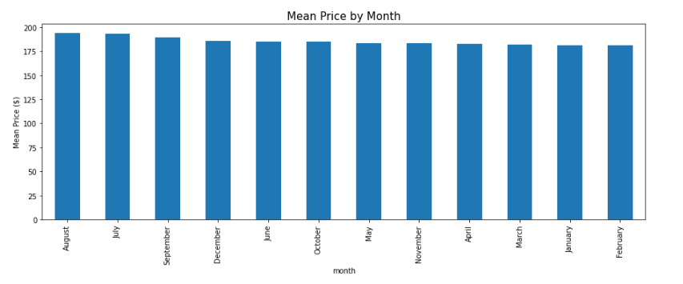
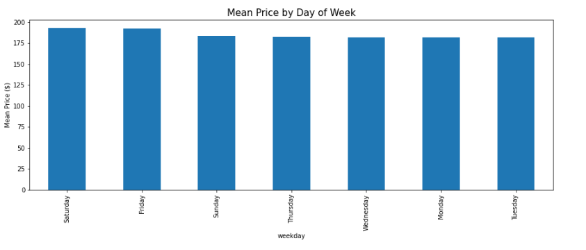
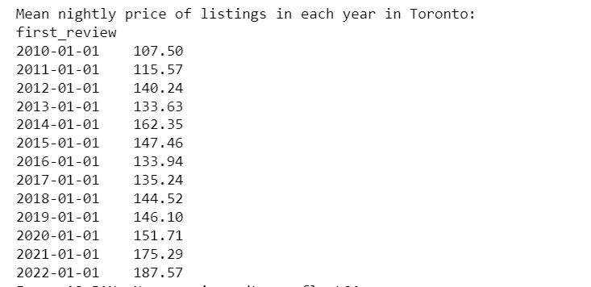
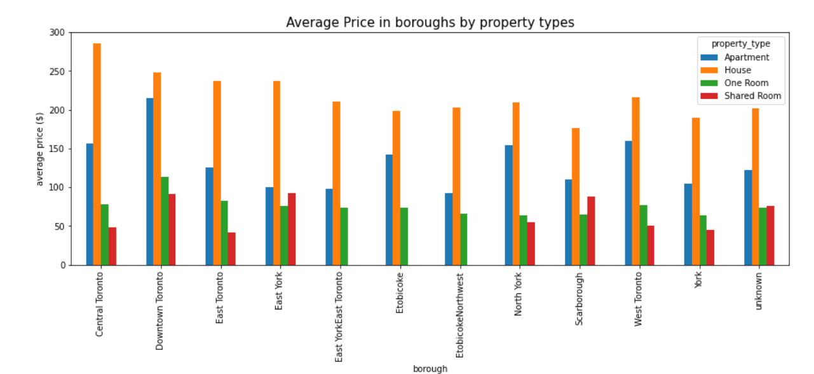
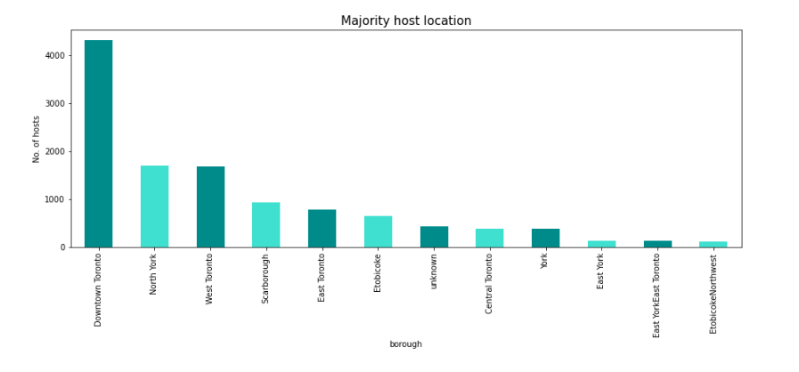
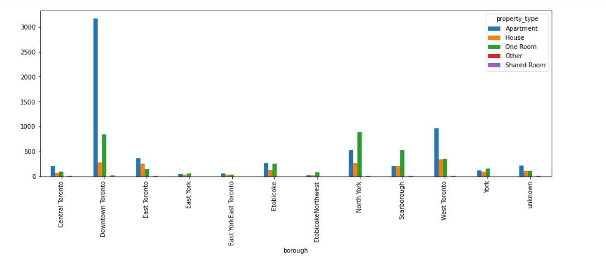

# Capstone_Project_Group_01

## Introduction

Airbnb is an American company that operates an online community marketplace for people to list, discover, and book accommodations worldwide. Home-owners (also known as 'hosts') are allowed to rent their properties (also known as 'listings') ranging from entire homes, apartments, single or shared bedrooms to individuals or businesses for a charge. 

## Business Problem

**" How much money is your place worth as a short-term rental on Airbnb? "**

Although Airbnb provides the host with a general tip regarding the default nightly price of their property upon listing, the final decision regarding the property price ultimately rests with the host. Paid third party pricing softwares are available, however the hosts are required to first determine the average price by themselves. The algorithm will then vary the daily price around the base price each day depending on several factors such as seasonality, day of the week, etc. In today's dynamic market, it is extremely important for the Airbnb owners to get the pricing right, particularly in big cities like Toronto, where there is stiff competition and a very thin line between success and failure.

## Our Goal

The average nightly price of Airbnbs in a city like Toronto can be influenced by multiple factors such as the type of property, number of people it accommodates, the amenties included, the neighbourhood where it is located, etc. This project aims to help the Airbnb hosts decide the average nightly price for their properties and maximize their earnings by using machine learning regression techniques that can accurately predict the base prices.

## Data Overview

The datasets used for this project are sourced from [Inside Airbnb](http://insideairbnb.com/). This site is not associated with or endorsed by Airbnb or any of its competitors. The data utilizes public information compiled from the Airbnb website. No "private" information has been used. The datasets used for this project are recent and was scraped on June 05,2022 and contains all the information on Toronto Airbnb listings that were active as on that date.

We have used the following datasets from the Inside Airbnb website :

- listings.csv.gz
- calendar.csv.gz
- neighbourhoods.geojson

Additionally, we have scraped data from [Wikipedia](https://en.wikipedia.org/wiki/List_of_postal_codes_of_Canada:_M) to extract the Toronto Borough names for the purpose of our analysis.

## Tools Used

For this project we have used the following tools and technologies:

Analysis:
- Python (Pandas, Numpy, Matplotlib, Seaborn)

Database:
- PostgreSQL and Amazon Web Services

Visualization:
- Python
- Tableau

Machine Learning:
- XGBoost Regression Model (Scikit-learn)

Notebook:
- Jupyter Notebook
- Google Colab

## Entity Relationship Diagram ( ERD)

- id - Airbnb's unique identifier for the listing

- host_since - the date host/user was created

- host_response_time - time taken for host to respond

- host_response_rate - the rate at which a host accepts booking requests

- host_is_superhost - whether a host is superhost or not

- host_listings_count - the number of listings the host has

- host_identity_verified - whether the host is verfied or not

- neighbourhood_cleansed - the neighbourhood as geocoded using the latitude and longitude against neighbourhoods as defined by open or digital public shapefiles

- latitude - uses the World Geodetic System (WGS84) projection for latitude and longitude.

- longitude - uses the World Geodetic System (WGS84) projection for latitude and longitude.

- property_type - self selected property type. Hotels and Bed and Breakfasts are described as such by their hosts in this field

- room_type - entire place, private room, shared room

- accommodates - the maximum capacity of the listing

- bathrooms - the number of bathrooms in the listing

- bedrooms - the number of bedrooms

- beds - the number of bed(s)

- amenities - amenties included with the property

- price - daily price in local currency

- minimum_nights - minimum number of night stay for the listing (calendar rules may be different)

- maximum_nights - maximum number of night stay for the listing (calendar rules may be different)

- availability_90 - the availability of the listing x days in the future as determined by the calendar. Note a listing may not be available because it has been booked by a guest or blocked by the host.

- number_of_reviews - the number of reviews the listing has

- number_of_reviews_ltm - the number of reviews the listing has (in the last 12 months)

- first_review - the date of the first/oldest review

- last_review - the date of the last/newest review

- review_scores_rating - rating score

- review_scores_accuracy - accuracy score

- review_scores_cleanliness -cleanliness score

- review_scores_checkin - checkin score

- review_scores_communication - communication score

- review_scores_location - location score

- review_scores_value - value score

- instant_bookable - whether the guest can automatically book the listing without the host requiring to accept the booking decision

## Database Model

Our raw data files are saved as S3 buckets in Amazon Web services.

A PostgreSQL database connection has been established using AWS and the cleaned data along with other dataframes have been stored in the database.

## Data Analysis

### Airbnb Listings Distribution in Toronto

### Number of hosts joining Airbnb each month

### Number of First Reviews

#### Observations

- From the graph, we can see that the number of hosts who joined Airbnb in Toronto was the highest in 2015 and had been more or less steady till 2019. The number has dropped since 2020 onwards. This drop could be an effect of COVID-19 or change in Government laws regarding short-term rentals in Toronto.
- The seasonality graphs for the number of reviews indicate more reviews during the middle of the year, particularly the summer months when tourism increases. That explains majority of hosts joining Airbnb at the same time of the year.

This fact gets further corroborated by the analysis done on the calendar.csv.gz file. According to the calendar file analysis, we can conclude that:

- Average nightly prices are the highest in August. This could be due to summer weather in Toronto accompanied by summer holidays in schools.
- In terms of weekdays, Saturdays command the highest average nightly prices.

### Average Number of Listings Per Host

#### Observations

- The average number of listings per year per host was highest around 2013 when Airbnb started gaining popularity in Canada. After 2013, 2019 was a good year for Airbnb, but the number of listings has again started going down since 2020 which could be attributed to the aftermath of COVID-19.
- Also, from the host_listings_count, it is clear that like other countries, there are professional Airbnb management companies in Toronto that host a large number of listings under a single host profile.

### Airbnb Yearly Average Price Change

#### Observations

- The average price of renting Airbnb has increased steadily since 2010. Particularly, prices have gone up since 2021.
- Average prices have gone up by 75% in 2022 compared to 2010.

### Average Price by location for different property types

#### Observations

- Renting an entire home is the most expensive in all boroughs followed by renting an entire apartment.
- Except Downtown Toronto, one rooms and shared rooms can be rented at less than $100 CAD.

### Location of Majority of Airbnb Hosts

#### Observations

- Majority of the hosts are located in Downtown Toronto. It seems to be the most popular location among guests.

### Majority of the Property Types in Toronto

#### Observations

- Most of the property types in Downtown Toronto region are apartments.
- West Toronto has the highest number of individual home type properties.
- One room options are mostly available in Downtown Toronto and North York

# Project Overview and Purpose

Airbnb is an online marketplace for short term rentals. Airbnb hosts are allowed to rent their entire homes, apartments, single or shared bedrooms. One of the main challenges faced by the Airbnb hosts is to determine the optimal rent prices. Price depends on number of factors such as property type, room types, ammetities, customer reviews and ratings, neighbourhoods, etc. The aim of this project is to propose a data driven solution by using machine learning to predict rental prices that would help the Toronto Airbnb hosts while renting out their properties.

# Reason for choosing this data

We have chosen to work with this dataset as Airbnb is market leader in this field. The dataset is challenging, recent, detailed, and includes many features and variables that would allow us to gain valuable insights into Airbnb's business model and would also allow us to utilize machine learning tools such as Linear Regression Model for price predictions. We have chosen the Toronto market since we are familiar with the city, but the same model can be used for similar predictions in any other cities where Airbnb is currently operating. Our interests and backgrounds in Retail/Tourism industries have also inspired us to take up this dataset.

# Data Source

Find the Inside Airbnb data on the following [link](http://insideairbnb.com/get-the-data). The datasets can be found inside the Resources folder on the project Github page. Airbnb does not provide open data. However, Inside Airbnb utlizes public information complied from the Airbnb website and allows analysis of publicly availible information about a city's Airbnb listings. Inside Airbnb is an independent, non commercial set of tools and the data is not associated with or endorsed by Airbnb or any of it's competitors.

# Communication Protocols

The following is an outline for communication protocols for the team. All team members have agreed to the following goals, communication methods as well as concequences of failing to follow these protocols for the duration of this project. These protocols are set in place to provide the team with a communication structure that can help the team successfully complete the project before its deadline. 

## Communication Goals

-  Daily communication amongst all team members regarding project timeline, progress on each deliverable and weekly goal
-  Establish a main line for communication for project needs, changes and emergencies
-  Team members will inform the team of any changes in project timeline and meeting deliverables for each segment

## Communication Type
Communications will be a mix of the following:
-  Slack and WhatsApp messages 
-  Daily standup meetings
-  Major milestone meetings

### Slack and WhatsApp messages
For daily communication amongst team members on questions regarding deliverables, technical tools needed to complete the weekly tasks. Instant messaging will also be used to communicate project emergencies.

### Daily standup meetings
Daily meetings will be held through Zoom. All team members have agreed upon meeting everyday to discuss progress on deliverables for sprint goals. This allows the team to get together and discuss any progress as well as any impedements they are facing.

### Major milestone meetings
Milestone meetings will be held on a biweekly basis as well as any time the team has acheived a remarkable win. These meetings are set to allow the team to retrospect their work and analysis of what was done well in each segment and more importantly what can be improved. 

## Consequences for Failing to Follow Communication Protocols

Each team member will be given 3 strikes to redeem themselves for any breach of the communication protocols. If the infractions continue the team member will not get the full credit for the team's success on the project.

# Tools Used

For this project we have used the following tools and technologies:

Analysis:
- Python (Pandas, Numpy, Matplotlib, Seaborn)

Database
- MongoDB

Visualization
- Python
- Tableau

Machine Learning
- Regression Model (Scikit-learn)

Notebook
- Jupyter Notebook
- Google Colab

Using Inside Airbnb data, this project will include descriptive analysis, using Pandas for data cleansing and MongoDB to store the data. It will also use machine learning to compare listings and predict the target value, using linear regression. Some of the features will include the neighborhood, type of listing, amenities, and information about the host. Visualization will be presented in Tableau dashboard, including visualizations.

# Hypothesis

Prices are dependent on factors such as neighbourhoods, room types, number of bedrooms, amenities, customer reviews and ratings for the host and proporty.

The images have been attached below for reference. 

## ERD Diagram

## Machine Learning Model

## ETL Pipeline Diagram

We are currently working on the [clean_data_final.ipynb](clean_data_final.ipynb) jupyter notebook file for the project.

