# Capstone_Project_Group_01

## Introduction

Airbnb is an American company that operates an online community marketplace for people to list, discover, and book accommodations worldwide. Home-owners (also known as 'hosts') are allowed to rent their properties (also known as 'listings') ranging from entire homes, apartments, single or shared bedrooms to individuals or businesses for a charge. 

## Business Problem

**" How much money is your place worth as a short-term rental on Airbnb? "**

Although Airbnb provides the host with a general tip regarding the default nightly price of their property upon listing, the final decision regarding the property price ultimately rests with the host. Paid third party pricing softwares are available, however the hosts are required to first determine the average price by themselves. The algorithm will then vary the daily price around the base price each day depending on several factors such as seasonality, day of the week, etc. In today's dynamic market, it is extremely important for the Airbnb owners to get the pricing right, particularly in big cities like Toronto, where there is stiff competition and a very thin line between success and failure.

## Our Goal

The average nightly price of Airbnbs in a city like Toronto can be influenced by multiple factors such as the type of property, number of people it accommodates, the amenties included, the neighbourhood where it is located, etc. This project aims to help the Airbnb hosts decide the average nightly price for their properties and maximize their earnings by using machine learning regression techniques that can accurately predict the base prices.

## Data Overview

The datasets used for this project are sourced from [Inside Airbnb](http://insideairbnb.com/). This site is not associated with or endorsed by Airbnb or any of its competitors. The data utilizes public information compiled from the Airbnb website. No "private" information has been used. The datasets used for this project are recent and was scraped on June 05,2022 and contains all the information on Toronto Airbnb listings that were active as on that date.

We have used the following datasets from the Inside Airbnb website :

- listings.csv.gz
- calendar.csv.gz
- neighbourhoods.geojson

Additionally, we have scraped data from [Wikipedia](https://en.wikipedia.org/wiki/List_of_postal_codes_of_Canada:_M) to extract the Toronto Borough names for the purpose of our analysis.

## Tools Used

For this project we have used the following tools and technologies:

Analysis:
- Python (Pandas, Numpy, Matplotlib, Seaborn)

Database:
- PostgreSQL and Amazon Web Services

Visualization:
- Python
- Tableau

Machine Learning:
- XGBoost Regression Model (Scikit-learn)

Notebook:
- Jupyter Notebook
- Google Colab

## Entity Relationship Diagram ( ERD)

- id - Airbnb's unique identifier for the listing

- host_since - the date host/user was created

- host_response_time - time taken for host to respond

- host_response_rate - the rate at which a host accepts booking requests

- host_is_superhost - whether a host is superhost or not

- host_listings_count - the number of listings the host has

- host_identity_verified - whether the host is verfied or not

- neighbourhood_cleansed - the neighbourhood as geocoded using the latitude and longitude against neighbourhoods as defined by open or digital public shapefiles

- latitude - uses the World Geodetic System (WGS84) projection for latitude and longitude.

- longitude - uses the World Geodetic System (WGS84) projection for latitude and longitude.

- property_type - self selected property type. Hotels and Bed and Breakfasts are described as such by their hosts in this field

- room_type - entire place, private room, shared room

- accommodates - the maximum capacity of the listing

- bathrooms - the number of bathrooms in the listing

- bedrooms - the number of bedrooms

- beds - the number of bed(s)

- amenities - amenties included with the property

- price - daily price in local currency

- minimum_nights - minimum number of night stay for the listing (calendar rules may be different)

- maximum_nights - maximum number of night stay for the listing (calendar rules may be different)

- availability_90 - the availability of the listing x days in the future as determined by the calendar. Note a listing may not be available because it has been booked by a guest or blocked by the host.

- number_of_reviews - the number of reviews the listing has

- number_of_reviews_ltm - the number of reviews the listing has (in the last 12 months)

- first_review - the date of the first/oldest review

- last_review - the date of the last/newest review

- review_scores_rating - rating score

- review_scores_accuracy - accuracy score

- review_scores_cleanliness -cleanliness score

- review_scores_checkin - checkin score

- review_scores_communication - communication score

- review_scores_location - location score

- review_scores_value - value score

- instant_bookable - whether the guest can automatically book the listing without the host requiring to accept the booking decision

## Database Model

Our raw data files are saved as S3 buckets in Amazon Web services.

A PostgreSQL database connection has been established using AWS and the cleaned data along with other dataframes have been stored in the database.

## Data Analysis

### Airbnb Listings Distribution in Toronto

### Number of hosts joining Airbnb each month

### Number of First Reviews

#### Observations

- From the graph, we can see that the number of hosts who joined Airbnb in Toronto was the highest in 2015 and had been more or less steady till 2019. The number has dropped since 2020 onwards. This drop could be an effect of COVID-19 or change in Government laws regarding short-term rentals in Toronto.
- The seasonality graphs for the number of reviews indicate more reviews during the middle of the year, particularly the summer months when tourism increases. That explains majority of hosts joining Airbnb at the same time of the year.

This fact gets further corroborated by the analysis done on the calendar.csv.gz file. According to the calendar file analysis, we can conclude that:

- Average nightly prices are the highest in August. This could be due to summer weather in Toronto accompanied by summer holidays in schools.
- In terms of weekdays, Saturdays command the highest average nightly prices.

### Average Number of Listings Per Host

#### Observations

- The average number of listings per year per host was highest around 2013 when Airbnb started gaining popularity in Canada. After 2013, 2019 was a good year for Airbnb, but the number of listings has again started going down since 2020 which could be attributed to the aftermath of COVID-19.
- Also, from the host_listings_count, it is clear that like other countries, there are professional Airbnb management companies in Toronto that host a large number of listings under a single host profile.

### Airbnb Yearly Average Price Change

#### Observations

- The average price of renting Airbnb has increased steadily since 2010. Particularly, prices have gone up since 2021.
- Average prices have gone up by 75% in 2022 compared to 2010.

### Average Price by location for different property types

#### Observations

- Renting an entire home is the most expensive in all boroughs followed by renting an entire apartment.
- Except Downtown Toronto, one rooms and shared rooms can be rented at less than $100 CAD.

### Location of Majority of Airbnb Hosts

#### Observations

- Majority of the hosts are located in Downtown Toronto. It seems to be the most popular location among guests.

### Majority of the Property Types in Toronto

#### Observations

- Most of the property types in Downtown Toronto region are apartments.
- West Toronto has the highest number of individual home type properties.
- One room options are mostly available in Downtown Toronto and North York

### Average Price by the number of people the property accommodates

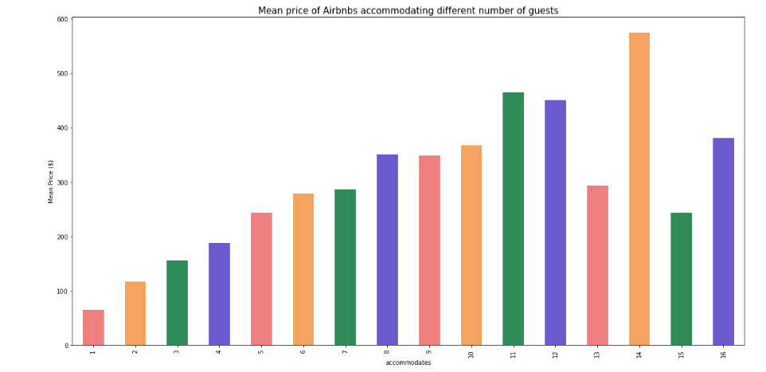

#### Observations

- properties that can accommodate 14 guests are the costliest.
- cheap options are available for single person at less than $100 per night.
- average rental prices are above $200 for number of guests exceeding 4

### 5 Most Expensive Neighbourhoods

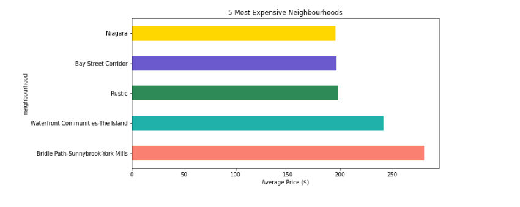

### Observations

The five most expensive neighbourhoods in Toronto are

- Bridle Path-Sunnybrook-York Mills with an average price of $281.
- Waterfront Communities-The Island with an average price of $ 242.
- Rustic with an average price of $198.
- Bay Street Corridor with an average price of $ 197.
- Niagara with an average price of $196.

### 5 Least Expensive Neighbourhoods

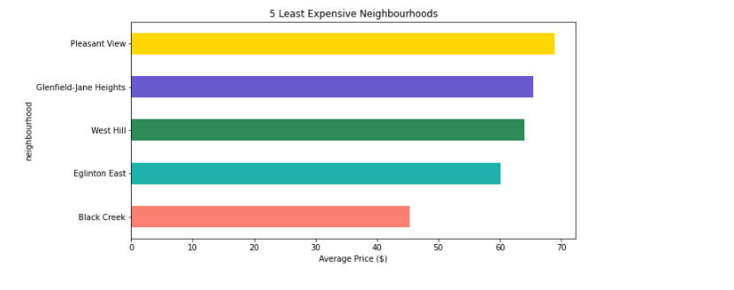

### Observations

The five least expensive neighbourhoods in Toronto are

- Black Creek with an average price of $45.
- Eglinton East with an average price of $60.
- West Hill with an average price of $64.
- Glenfield-Jane Heights with an average price of $65.
- Pleasant View with an average price of $69.

### Maximum and Minimum Price by Borough

### Observations

- East YorkEast Toronto region seems to be the cheapest of all boroughs with a maximum price of approximately $500.
- There is a huge difference between the minimum and maximum prices in all boroughs.
- Minimum prices can be less than $50 while maximum prices can go beyond $800.

### How much difference does the ratings make in terms of price?

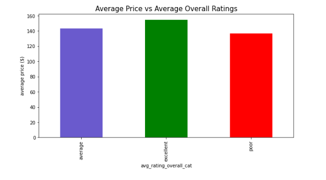

### Observations

- Properties with Excellent Ratings can charge 8.4% higher prices than properties with Average Ratings.
- Properties with Excellent Ratings can charge 13% higher prices on an average compared to properties with Poor Ratings.

### Does Being a SuperHost have an impact on price?

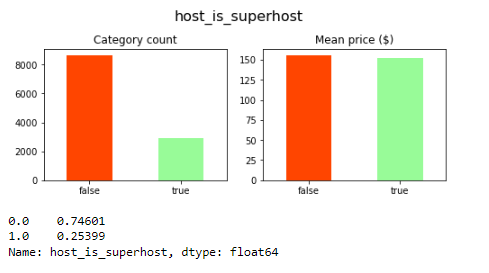

### Observations

- Around 25% of the Airbnb hosts are superhosts
- However, being a superhost does not seem to have a significant impact on average price charged per night.

### Is there significant relationship between price and verified host identity?

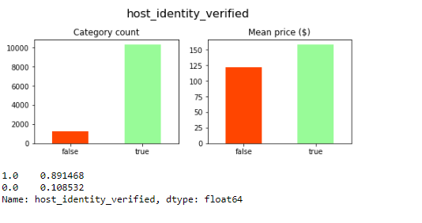

### Observations

- Around 90% of the Airbnb hosts in Toronto are verified.
- Hosts with verified identity charge approximately 25% higher prices compared to hosts whose identities are not verified.

### Relationship between price and Instant Booking Priviledges

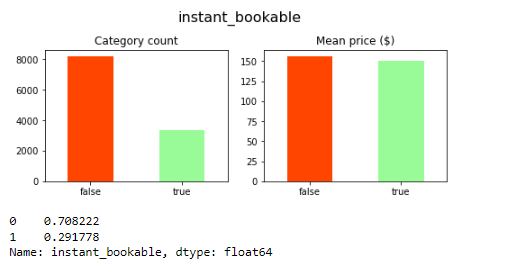

### Observations

- Around 29% of the Airbnbs in Toronto are instantly bookable.
- It does not provide any benefits in terms of average nighly prices charged.

### Popular Amenities and their impact on Average Price

    

### Observations

Most Airbnbs provide amenties like:

- Toiletries - like soap and shampoo
- high-end electronics - like TV and music systems
- Air Conditioners and heaters
- Internet
- Home Appliances like microwaves, refrigerator,etc
- Coffee Machines
- Long term stays
- Safety equipments like fire alarms
- Bed linens, pillows and closets
- Parking Facilities
- Kitchen

Most Airbnbs charge higher average prices for amenities like:

- Toiletries
- High-end electronics
- Air conditioning and heating
- BBQ facilities
- Home Appliances and coffee machines with kitchen
- Safety features
- Outdoor Space and hot-tubs or pools
- Parking, elevators and gyms

### Additional Observations

- There is not much difference in price for providing Internet.
- Places allowing long term stays and host greetings have lower rent prices per night.

## Machine Learning for Price Predictions

We have tried different machine learning regression models on the clean data to predict prices as accurately as possible. All columns with high correlation were removed and the numeric columns have been log transformed to reduce skewness as much as possible. Then the data has been scaled using a Standard Scaler for consistency.

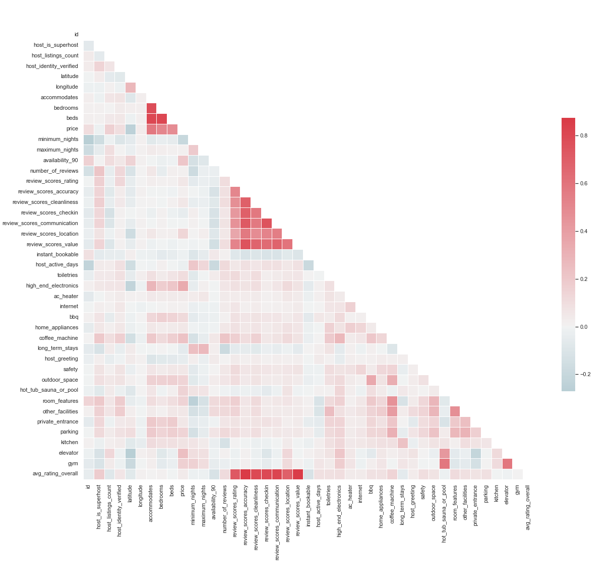

### Different Models Tried:

- Linear Regression Model - RMSE test: 0.393 , R^2 test: 0.682
- Support Vector Regression Model - RMSE test: 0.394, R^2 test: 0.681
- GradientBoostingRegressor Model - RMSE test: 0.363, R^2 test: 0.728
- RandomForestRegressor Model - RMSE test: 0.357, R^2 test: 0.738
- ExtraTreesRegressor Model - RMSE test: 0.362, R^2 test: 0.730
- XGBoostRegressor Model - RMSE test: 0.347, R^2 test: 0.753

Based on a rule of thumb, it can be said that RMSE (Root Mean Square Error) values between 0.2 and 0.5 shows that the model can relatively predict the data accurately. With our XGBoost Regressor model, we have been able to achieve a RMSE training score of 0.265 and a RMSE testing score of 0.347 along with a R² score of 75.3% which indicates that 75.3% of the variation in Airbnb nightly prices can be attributed to factors such as superhost, verified host identity, host listings count, amenities, neighbourhood, host response, etc.

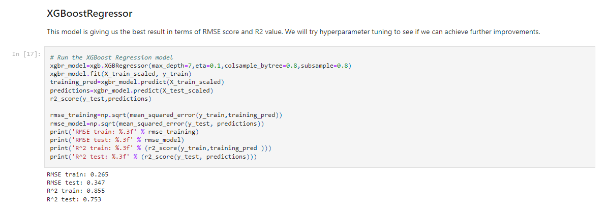

### Hyper-Parameter Tuning Using GridSearchCV and RandomSearch CV

We have further tried to improve our model through hyper-parameter tuning using GridSearchCV and RandomSearch CV methods. Deep Learning methods were not tested on this data since we felt that the volume of data available does not justify using neural networks. However, there has not been any significant improvements in the results.

##### GridSearchCV Results

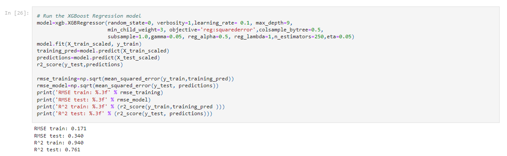

After hyper-parameter tuning using the GridSearchCV method, we achieved an RMSE testing score of 0.340 with a R² score of 76.1%.

##### RandomSearchCV Results

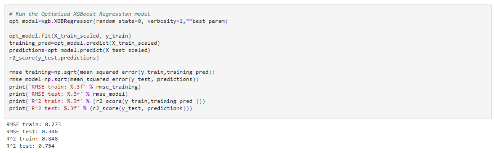

After hyper-parameter tuning using the GridSearchCV method, we achieved an RMSE testing score of 0.346 with a R² score of 75.4%.

#####  Top 10 Feature Importance using XGBoost Regressor Model

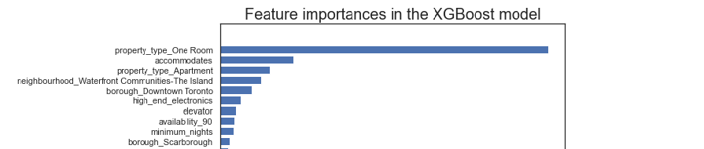

## Summary

- summer is the best time for Airbnb business in Toronto.
- Average prices are highest in August and the most expensive day of the week is Saturday.
- Average nightly prices have increased by 7% in 2022 compared to 2021.
- Minimum prices can be less than $50 while maximum prices can go beyond $800.
- Majority of the Airbnbs in Toronto are located in the Downtown region.
- Majority of the Airbnb properties in Toronto are apartments.
- Airbnb hosts can charge minimum $200 CAD for renting an entire home in majority locations in Toronto.
- Renting an entire apartment in Downtown Toronto can cost around $200 CAD on an average. 
-  East YorkEast Toronto region seems to be the cheapest of all boroughs with a maximum price of approximately $500.
- For single guests, many one room options are available in the Downtown region and North York. Many cheap options are available at less than $100 per night.
- Average nightly price is minimum $200 CAD for number of guests exceeding 4 but approximately $550 for 14 guests.
- Properties with "Excellent" Ratings can charge significantly higher prices.
- Being a superhost does not seem to have a significant impact on average price charged per night.
- Hosts with verified identity charge approximately 25% higher prices compared to hosts whose identities are not verified.
- Instant Booking priviledges does not provide any benefits in terms of average nighly prices charged.
- Places allowing long term stays and host greetings have lower rent prices per night.
- Airbnbs can charge higher prices for certain amenities like high-end electronics, home appliances, pools or hot-tubs, bbq facilities, parking, elevator, gyms,etc.

